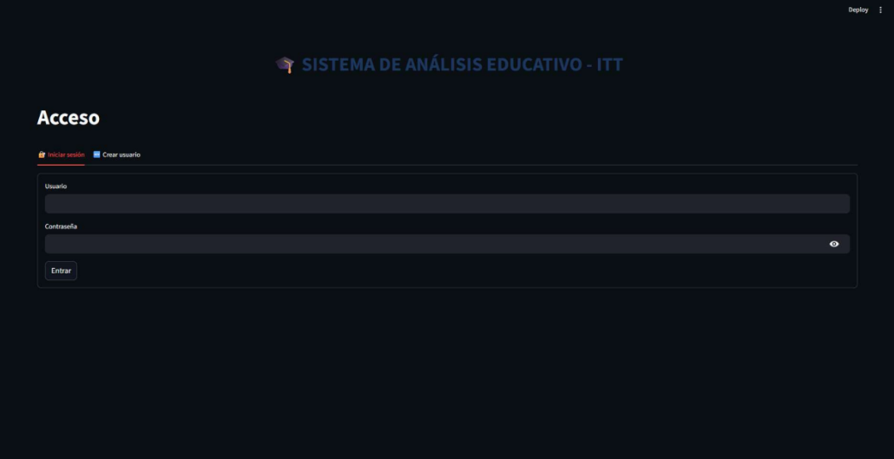
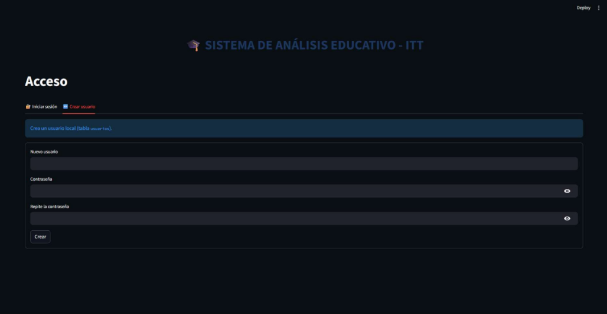
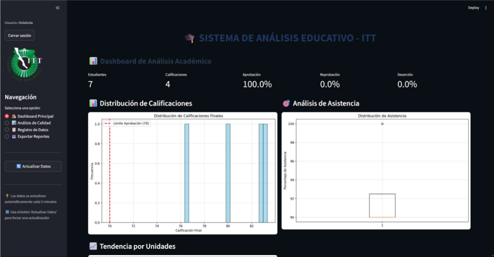
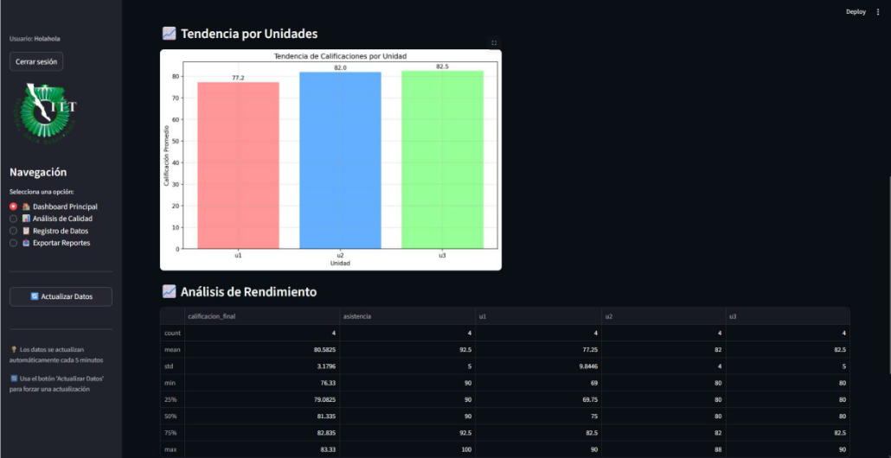
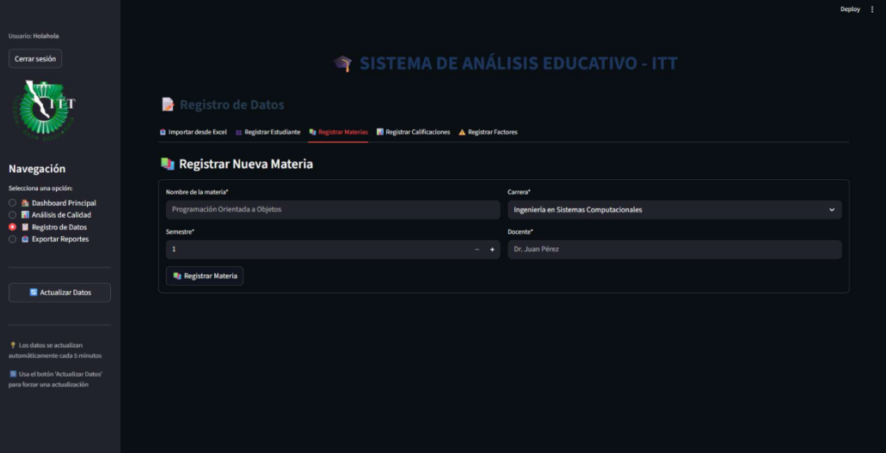
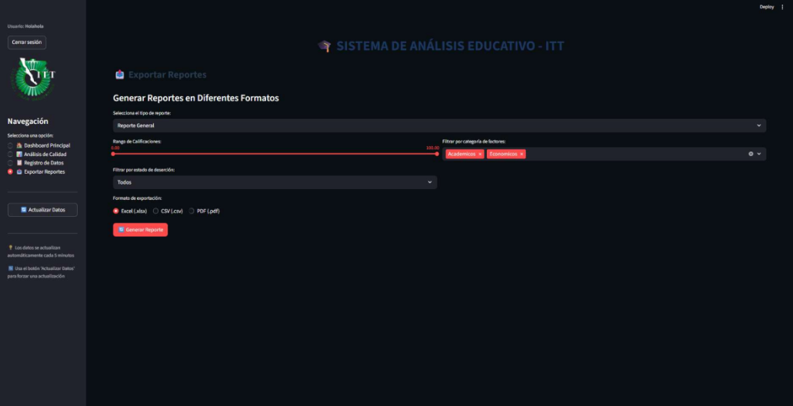
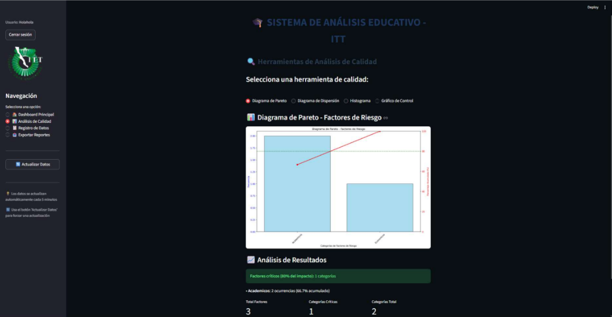
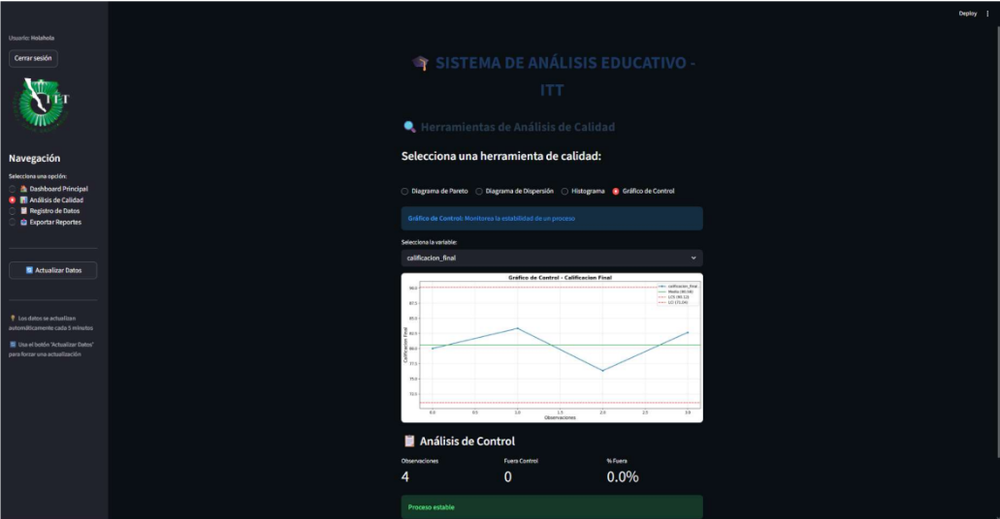

# ExamenUnidad2_TemasAV_1raParte
# Sistema de Análisis Educativo

Aplicación web desarrollada en Python para el análisis académico y detección de factores de riesgo en estudiantes.  
Permite visualizar métricas clave mediante dashboards interactivos y generar reportes filtrados para apoyo en la toma de decisiones.

## Tecnologías Utilizadas

- **Python**
- **Streamlit** (Frontend / UI interactiva)
- **Supabase** (Backend como un servicio)
- **PostgreSQL** (Base de datos relacional)
- **Pandas / Matplotlib** (Análisis y visualización de datos)

## Funcionalidades Principales

- Registro y gestión de estudiantes, materias y calificaciones
- Modelado de base de datos relacional (Modelo ER y UML)
- Dashboard interactivo con:
  - Distribución de calificaciones
  - Análisis de asistencia
  - Tendencia por unidades
  - Tabla de análisis de rendimiento
- Herramientas estadísticas:
  - Diagrama de Pareto
  - Diagrama de dispersión (análisis de correlación)
  - Histograma (media y mediana)
  - Gráfico de control
- Importación de datos desde archivos Excel
- Exportación de reportes filtrados en distintos formatos
- Sistema de autenticación de usuarios

## Arquitectura del Proyecto

El sistema sigue una arquitectura cliente-servidor:

- **Frontend:** Streamlit
- **Backend:** Supabase (API REST automática)
- **Base de datos:** PostgreSQL relacional

La base de datos incluye relaciones entre:
- Estudiantes
- Carreras
- Materias
- Calificaciones
- Factores de riesgo
- Usuarios

---

## Instalar dependencias:
pip install -r requirements.txt

## Ejecutar la aplicación:
streamlit run app.py

---

## 📷 Capturas del Sistema

## Inicio de Sesión

## Crear Usuario

## Dashboard Principal

## Dashboard Principal 2

## Registro Estudiantes

## Registro Materias

## Exportar Reportes

## Diagrama de Pareto

## Grafico de Control

